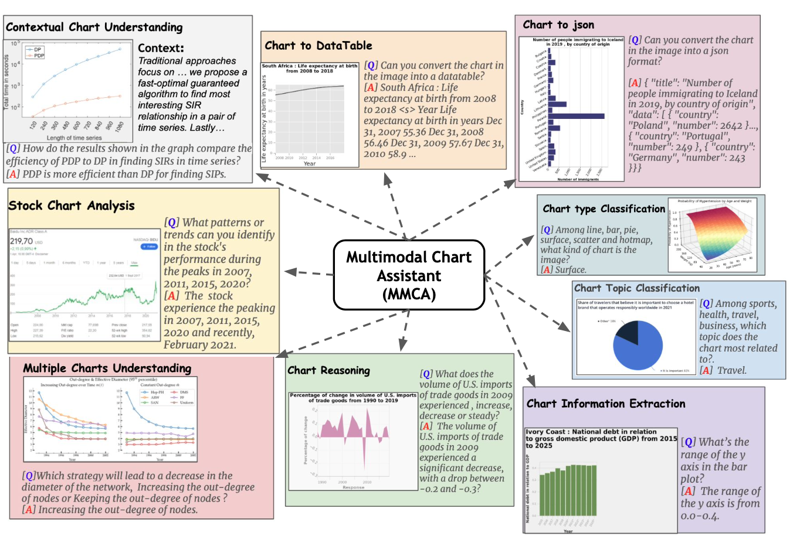

# MMC: Advancing Multimodal Chart Understanding with LLM Instruction Tuning [[NAACL 2024]](https://2024.naacl.org)

This is the PyTorch implementation of the paper ***MMC: Advancing Multimodal Chart Understanding with LLM Instruction Tuning***, the paper is available at https://arxiv.org/abs/2311.10774.

# Contact

If you have any questions about this work, please email Fuxiao Liu [fl3es@umd.edu](fl3es@umd.edu). 

```
@article{liu2023mmc,
  title={MMC: Advancing Multimodal Chart Understanding with Large-scale Instruction Tuning},
  author={Liu, Fuxiao and Wang, Xiaoyang and Yao, Wenlin and Chen, Jianshu and Song, Kaiqiang and Cho, Sangwoo and Yacoob, Yaser and Yu, Dong},
  journal={arXiv preprint arXiv:2311.10774},
  year={2023}
}
@article{liu2023aligning,
  title={Aligning Large Multi-Modal Model with Robust Instruction Tuning},
  author={Liu, Fuxiao and Lin, Kevin and Li, Linjie and Wang, Jianfeng and Yacoob, Yaser and Wang, Lijuan},
  journal={arXiv preprint arXiv:2306.14565},
  year={2023}
}
@article{liu2023hallusionbench,
  title={HallusionBench: You See What You Think? Or You Think What You See? An Image-Context Reasoning Benchmark Challenging for GPT-4V (ision), LLaVA-1.5, and Other Multi-modality Models},
  author={Liu, Fuxiao and Guan, Tianrui and Li, Zongxia and Chen, Lichang and Yacoob, Yaser and Manocha, Dinesh and Zhou, Tianyi},
  journal={arXiv preprint arXiv:2310.14566},
  year={2023}
}
```

# Note

- We introduce a large-scale MultiModal Chart Instruction (**MMC-Instruction**) dataset supporting diverse tasks and chart types. Leveraging this data.
- We develop Multi-Modal Chart Assistant (MMCA), an LMM that achieves state-of-the-art performance on existing chart QA benchmarks.
- We also propose a Multi-Modal Chart Benchmark (**MMC-Benchmark**), a comprehensive human-annotated benchmark with nine distinct tasks evaluating reasoning capabilities over charts. Extensive experiments on MMC-Benchmark reveal the limitations of existing LMMs on correctly interpreting charts, even for the most recent GPT-4V model. 

<p align="center">
    <a href="https://llava.hliu.cc/"></a> <br>
</p>

# News

- [03/13]🔥 Our paper ["MMC: Advancing Multimodal Chart Understanding with LLM Instruction Tuning"](https://arxiv.org/pdf/2311.10774.pdf) is accepted to **[NAACL 2024](https://2024.naacl.org)**.
- [02/26]🔥 Our paper ["HallusionBench: You See What You Think? Or You Think What You See? An Image-Context Reasoning Benchmark Challenging for GPT-4V(ision), LLaVA-1.5, and Other Multi-modality Models"](https://arxiv.org/abs/2310.14566) is accpeted to **[CVPR 2024](https://cvpr.thecvf.com)**.
- [01/15]🔥 Our paper [Mitigating Hallucination in Large Multi-Modal Models via Robust Instruction Tuning](http://arxiv.org/abs/2306.14565) is accepted by **[ICLR 2024](https://iclr.cc)**

## MMC-Instruction Dataset
### Non-arxiv
```
#Part 1
#Images
gdown https://drive.google.com/file/d/1Y17wNYdBlPxhB5KKiux2BD8C2FlA5MC9
#Text
gdown https://drive.google.com/file/d/1tUtntLRgsBJ9v5NcdTMvVI32ruLHAyFe
#Part2
#Images
gdown https://drive.google.com/uc?id=1Dey-undzW2Nl21CYLFSkP_Y4RrfRJkYd
#Text
gdown https://drive.google.com/uc?id=13j2U-ectsYGR92r6J5hPdhT8T5ezItHF
#Part3
#Images
gdown https://drive.google.com/file/d/1W8sQ6fLkOm8bZo_SrRIiIGELS90aNKq7
#Text
gdown https://drive.google.com/file/d/1o3Edkf6bdyZloe_FSth8wtNmkFf_Bda_
```
### arxiv
```
#Images
gdown https://drive.google.com/file/d/1QKQOMIH9Wd3EQEYr3IV2u9qQXmSZy49G
#Text
gdown https://drive.google.com/file/d/1PI1EdgPk-gBi29adk25cjGtwskyBjcN9
```
#More will be released!


## MMC-Benchmark
### Images
```
gdown https://drive.google.com/file/d/19CA-AFKshOVEOabK3-pkkZfjbtaJFP7Y
```
### Questions and Answers
```
gdown https://drive.google.com/file/d/1HOVhPuFJ0roaHt-6AFyYX2E5MxKjoFug
```

## MMCA Gradio demo
```
sh demo/start.sh
```

